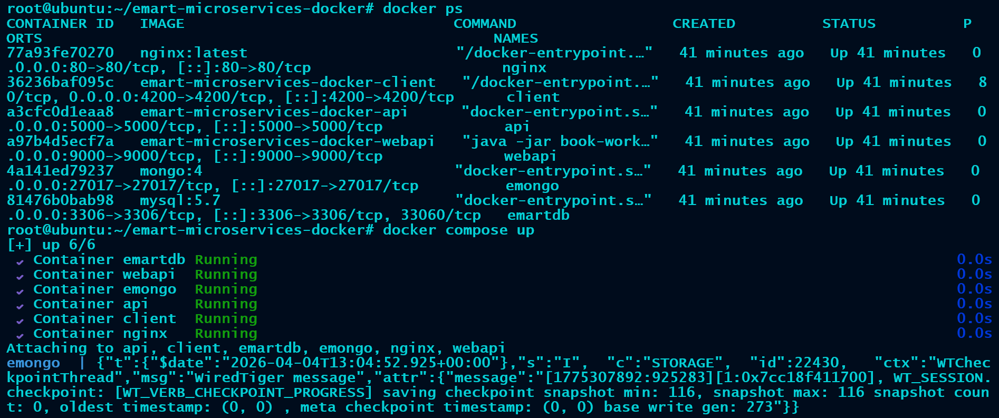
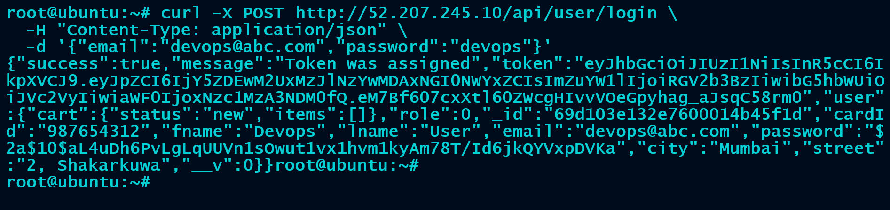
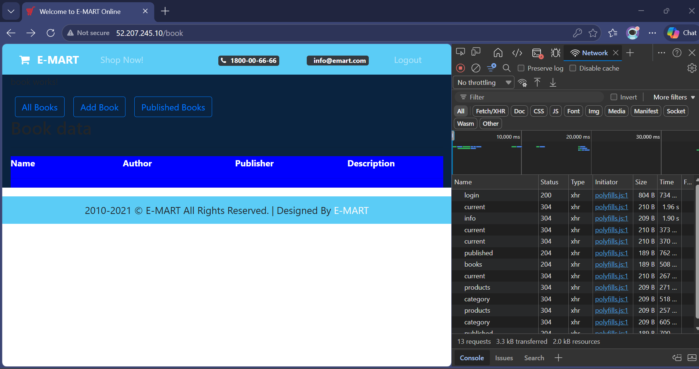
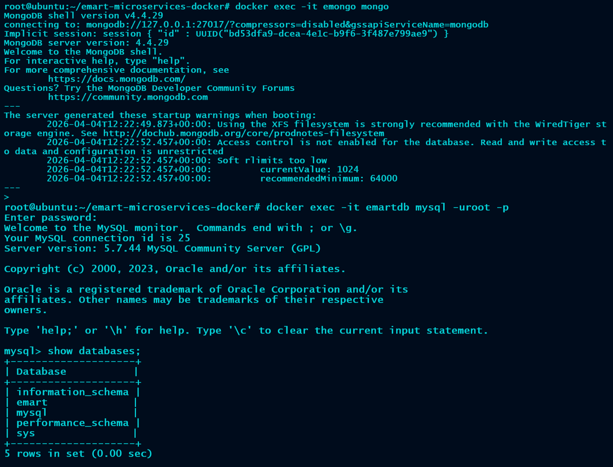

# 🚀 E-MART Microservices DevOps Platform


A production-style microservices application deployed using Docker Compose with Nginx as a reverse proxy, integrating multiple backend services and databases.

---

## 📌 Project Overview

This project demonstrates a **real-world DevOps architecture**:

* Angular frontend (client)
* Node.js API (MongoDB)
* Spring Boot API (MySQL)
* Nginx reverse proxy (API Gateway)
* Docker Compose orchestration

It simulates how modern e-commerce platforms are deployed in containerized environments.

---

## 🧠 Architecture


### 🔹 Flow

```
User (Browser)
      ↓
Nginx (Reverse Proxy)
   ├── /        → Angular Client
   ├── /api     → Node.js API (MongoDB)
   └── /webapi  → Spring Boot API (MySQL)
```

---

## 📦 Repository Structure

```
.
├── client/                # Angular frontend
├── nodeapi/               # Node.js backend (MongoDB)
├── javaapi/               # Spring Boot backend (MySQL)
├── nginx/                 # Reverse proxy configuration
├── docker-compose.yaml    # Multi-container orchestration
├── docs/screenshots       # Screenshots & documentation
├── architecture-diagram/  # System design diagrams
├── kkartchart-sample/     # Helm chart (Kubernetes - future use)
├── Jenkinsfile.sample     # CI/CD pipeline (future use)
└── README.md
```

---

## ⚙️ Technologies Used

* Docker & Docker Compose
* Nginx (Reverse Proxy)
* Angular (Frontend)
* Node.js + Express (API)
* Spring Boot (Java API)
* MongoDB
* MySQL
* AWS EC2 (Deployment)

---

## 🚀 Deployment (Docker Compose)

### 1️⃣ Clone Repository

```bash
git clone <your-repo-url>
cd emart-microservices-docker
```

---

### 2️⃣ Start Services

```bash
docker compose up --build -d
```

---

### 3️⃣ Access Application

```
http://<EC2-PUBLIC-IP>
```

---

## 📸 Screenshots

### 🐳 Containers Running



---

### 🌐 Application UI


---

### 🔐 API Validation (Node API via Nginx)



---

### 🔁 Frontend ↔ Backend Integration



---

### 🗄️ Database Connectivity



---

## 🔍 API Endpoints

### Node API

```
POST /api/user/login
POST /api/user/register
```

---

### Java API

```
GET /webapi/books
GET /webapi/published
```

---

## 🔧 Reverse Proxy (Nginx)

Handles routing between services:

```nginx
location / {
    proxy_pass http://client/;
}

location /api/ {
    proxy_pass http://api:5000;
}

location /webapi/ {
    proxy_pass http://webapi:9000;
}
```

---

## 🧪 Validation Commands

```bash
# Node API
curl -X POST http://<IP>/api/user/login \
-H "Content-Type: application/json" \
-d '{"email":"devops@abc.com","password":"devops"}'

# Java API
curl http://<IP>/webapi/books
```

---

## 🚀 Future Enhancements

### 🔹 CI/CD Pipeline

* Jenkins pipeline included (`Jenkinsfile.sample`)
* Can be extended to automate build & deployment

---

### 🔹 Kubernetes Deployment

* Helm chart available (`kkartchart-sample/`)
* Enables migration to Kubernetes clusters

---

### 🔹 Improvements

* Add HTTPS (SSL with Nginx)
* Add monitoring (Prometheus + Grafana)
* Add centralized logging (ELK stack)

---

## 🧠 Key Learnings

* Microservices architecture deployment
* Reverse proxy design (Nginx)
* Container networking in Docker
* Debugging 502 / routing issues
* Multi-database integration
* Production-style service separation

---

## 📌 Author

**DevOps Portfolio Project**

---

## ⭐ Conclusion

This project demonstrates the ability to:

* Design scalable microservices architecture
* Deploy multi-container applications
* Implement reverse proxy routing
* Debug real-world deployment issues

---

💡 *This is a production-style DevOps implementation showcasing real-world deployment practices.*
